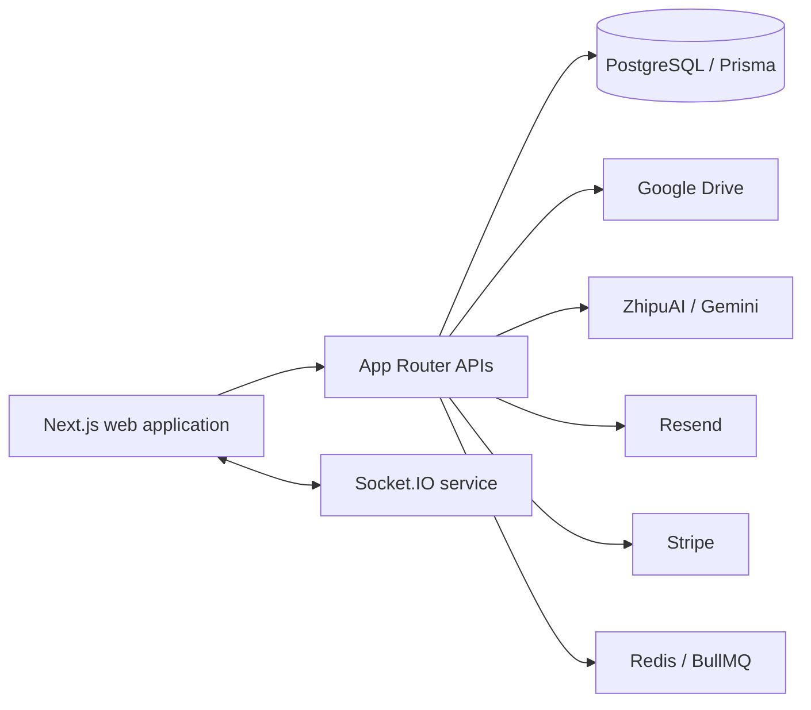

# Book Heaven

**A digital library, reading companion, and community marketplace in one application.**

[](https://bookheavenbeta.vercel.app)
[](LICENSE)
[](https://www.supportkori.com/montasim)

Book Heaven brings searchable digital and physical collections, browser-based
reading, AI-assisted book conversations, quizzes, community publishing, and a
buy/sell marketplace into a single Next.js application. Readers can discover
and organize books; librarians and administrators get publishing, moderation,
analytics, and content-processing workflows.

**[Explore Book Heaven](https://bookheavenbeta.vercel.app)** ·
[Browse the documentation](docs/INDEX.md)

> **Project status:** Book Heaven is a broad beta application with several
> external services. Browsing depends mainly on PostgreSQL and stored content;
> AI chat, email, file storage, payments, asynchronous processing, OAuth, and
> real-time messaging each require their own credentials or infrastructure.

## Reader experience

- Browse digital books, physical-library holdings, authors, translators,
  publications, series, categories, blog posts, and notices.
- Open supported digital books in the in-browser reader and maintain personal
  shelves, uploads, reading history, and borrowed-book records.
- Ask questions about processed book content through a retrieval-assisted chat
  workflow with ZhipuAI and Gemini provider support.
- Discover books through mood-based recommendations and take generated quizzes
  with achievements, streaks, and a leaderboard.
- List and browse second-hand books, exchange offers, and continue negotiations
  through marketplace conversations.
- Create an account with email verification or configured Google/GitHub OAuth.

## Library and administration

- Manage books, authors, translators, publications, categories, series,
  notices, blog content, legal pages, FAQs, pricing, and site settings.
- Upload and process book files, covers, author media, and audio assets through
  the configured Google Drive and processing services.
- Review reader activity, book analytics, AI usage and cost data, marketplace
  activity, contact submissions, and support tickets.
- Configure Stripe-backed subscription tiers and webhook processing.
- Run WebSocket messaging with a Redis adapter, while clients can fall back to
  HTTP polling when the socket service is unavailable.

## Architecture



The Next.js application owns the public site, authenticated reader areas,
administration dashboard, and HTTP APIs. Prisma models the application data in
PostgreSQL. `server.ts` runs the optional Socket.IO process, and external
processing and storage integrations are kept behind server-side routes.

## Run locally

### Requirements

- Node.js 20.19 or newer
- npm
- PostgreSQL
- Infisical CLI only if you use the default secret-managed `dev` or `build`
  scripts

```bash
git clone https://github.com/montasim/book-heaven.git
cd book-heaven
npm install
cp .env.example .env.local
npx prisma generate
npx prisma migrate deploy
npm run dev:plain
```

Open <http://localhost:3000>.

The checked-in `.env.example` is a reference template: many server-side
variables are commented out because production secrets are normally injected
through Infisical. Uncomment and replace the values required by the workflows
you plan to exercise. Never commit `.env.local` or exported Infisical secrets.

### Minimum configuration

| Variable | Required for | Purpose |
| --- | --- | --- |
| `DATABASE_URL` | Application | PostgreSQL connection used by Prisma |
| `SESSION_SECRET` | Email/password auth | Session and authentication secret |
| `BASE_URL`, `NEXT_PUBLIC_APP_URL` | Application | Server and browser origins |
| `RESEND_API_KEY`, `FROM_EMAIL` | OTP and notification email | Resend credentials and verified sender |
| `GOOGLE_CLIENT_EMAIL`, `GOOGLE_PRIVATE_KEY`, `GOOGLE_DRIVE_FOLDER_ID` | Managed media | Google service account and Drive folder |
| `ZHIPU_AI_API_KEY` | Primary AI chat | ZhipuAI provider key |
| `GEMINI_API_KEY` | AI fallback and embeddings | Gemini provider key |
| `STRIPE_SECRET_KEY`, `STRIPE_WEBHOOK_SECRET`, `NEXT_PUBLIC_STRIPE_PUBLISHABLE_KEY` | Subscriptions | Stripe server, webhook, and browser keys |
| `NEXT_PUBLIC_WS_URL`, `WEBSOCKET_SERVER_URL`, `WEBSOCKET_API_KEY` | Live marketplace messaging | Socket service URLs and shared authentication key |
| `PDF_PROCESSOR_URL`, `PDF_PROCESSOR_API_KEY` | Book processing | External processor endpoint and service key |
| `REDIS_HOST`, `REDIS_PORT`, `REDIS_PASSWORD` | Queues and socket scaling | Redis connection |

OAuth, Stripe price IDs, Turnstile, provider model selection, and other
optional settings are described in [`.env.example`](.env.example). The more
focused authentication walkthrough is in [`docs/SETUP.md`](docs/SETUP.md).

## Development commands

| Command | Purpose |
| --- | --- |
| `npm run dev` | Run Next.js with `dev` secrets injected by Infisical |
| `npm run dev:plain` | Run Next.js from local environment files |
| `npm run dev:ws` | Run the Socket.IO service with Infisical |
| `npm run build` | Build Next.js with `prod` secrets from Infisical |
| `npm run build:normal` | Generate Prisma Client and build from the current environment |
| `npm run build:plain` | Build Next.js without first generating Prisma Client |
| `npm run start` | Serve the production Next.js build |
| `npm run start:ws` | Run the Socket.IO service in production mode |
| `npm run lint` | Run ESLint |

Use `npx prisma studio` to inspect a configured development database. Schema
migrations live under `prisma/migrations/` and should be reviewed before they
are applied to shared or production data.

## Documentation

| Topic | Guide |
| --- | --- |
| Documentation map | [`docs/INDEX.md`](docs/INDEX.md) |
| Authentication and local services | [`docs/SETUP.md`](docs/SETUP.md) and [`docs/AUTH_README.md`](docs/AUTH_README.md) |
| AI book chat | [`docs/AI_CHAT.md`](docs/AI_CHAT.md) |
| Content extraction | [`docs/BOOK_CONTENT_EXTRACTION.md`](docs/BOOK_CONTENT_EXTRACTION.md) |
| Mood recommendations | [`docs/MOOD_RECOMMENDATIONS.md`](docs/MOOD_RECOMMENDATIONS.md) |
| Quizzes and gamification | [`docs/QUIZ_GAMIFICATION.md`](docs/QUIZ_GAMIFICATION.md) |
| Marketplace | [`docs/MARKETPLACE.md`](docs/MARKETPLACE.md) |
| Subscriptions | [`docs/SUBSCRIPTION_SETUP.md`](docs/SUBSCRIPTION_SETUP.md) |
| Administration | [`docs/ADMIN_DASHBOARD.md`](docs/ADMIN_DASHBOARD.md) |

Some files in `docs/` describe implementation plans as well as shipped
behavior. Confirm planned work against routes, database models, and the running
application before relying on it operationally.

## Project map

```text
src/app/               Public, authenticated, admin, and API routes
src/components/        Shared and feature-facing React components
src/lib/               Auth, AI, storage, jobs, payments, and domain services
src/types/             Shared TypeScript contracts
prisma/                PostgreSQL schema and migrations
docs/                  Setup, feature, and operational notes
server.ts              Optional Socket.IO service
```

## Deployment

The maintained beta is hosted at
[bookheavenbeta.vercel.app](https://bookheavenbeta.vercel.app). A complete
deployment may also include PostgreSQL, Google Drive, Redis, a Socket.IO
service, the PDF processor, Resend, AI providers, and Stripe. Store secrets in
the deployment platform or Infisical, use production callback URLs, and apply
database migrations as an explicit release step.

## Security and limitations

- Uploaded books may be copyrighted or sensitive. Deployers are responsible
  for permissions, access rules, takedown handling, and storage retention.
- AI answers and generated quizzes can be incorrect; retain links to source
  content and do not treat generated output as authoritative.
- Payment and webhook flows require HTTPS, verified webhook signatures, and
  production Stripe configuration.
- Real-time messaging is optional; HTTP polling is the documented fallback.
- The repository has no committed automated test command. A successful build
  and lint run do not replace integration testing of configured services.

Report sensitive vulnerabilities privately through the contact links on
[the maintainer's GitHub profile](https://github.com/montasim), not in a public
issue.

## Contributing

Focused bug fixes and documentation improvements are welcome. Open an issue or
pull request with the behavior being changed, migration or configuration
impact, and the checks performed. Keep feature-plan documents clearly
separated from current behavior.

If Book Heaven is useful to you, optional support through
[SupportKori](https://www.supportkori.com/montasim) helps fund hosting and
continued development.

## License

Licensed under the [MIT License](LICENSE).

## Maintainer

[Mohammad Montasim Al Mamun Shuvo](https://github.com/montasim)
